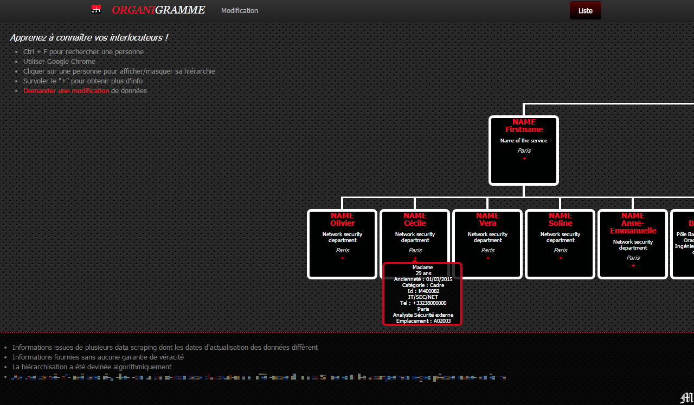

# Fork
Forked from https://github.com/wesnolte/jOrgChart

# Presentation
I created this project to help my colleagues get to know each other better.
If you work in a large company, you have probably already heard: "But who the f*** is this person who has just called me?!".
This will help you find your contact and know which department he / she belongs to and who is his or her supervisor.

# Important
This project **fits only the data structure I created** to meet my need.
My database is obviously not publicly available.

Therefore, if you want to create an organizational chart, **I recommend you to consult the original project**:
Please, see [this GitHub](https://github.com/wesnolte/jOrgChart) for more informations about jOrgChart.

# Overview
Here is an overview of my project:

# Author 
[Maarti](http://bryan.maarti.net?lang=en)